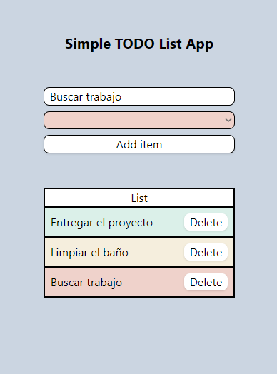

# Simple TODO List App

Una aplicación web construida con React, Redux y TypeScript que permite agregar tareas pendientes a una lista.

## Información Técnica

### Características

La aplicación integra diversas tecnologías, dependencias como:

- [Axios](https://axios-http.com/): Para las peticiones a la API.
- [Redux toolkit](https://reactjs.org/docs/context.html): Para el manejo del estado global de la aplicación.
- [Tailwind CSS](https://tailwindcss.com/): Para el diseño y la implementación de la interfaz de usuario.
- [formkit/auto-animate](https://auto-animate.formkit.com/#usage-react) y [sweetalert2](https://sweetalert2.github.io): Para agregar alertas y efectos en la lista.

## Observaciones y dificultades

Decidí crear este proyecto desde cero utilizando la plantilla `npx create-react-app todo-list --template typescript`. Esta elección me brindó la oportunidad de poner nuevamente a prueba mis habilidades blandas al volver a leer la documentación de Redux y actualizarme en la sintaxis de Redux Toolkit. Aunque la tarea en sí resultó bastante sencilla, fue sumamente enriquecedora gracias a los conocimientos que adquirí.

Aunque no era un requisito inicial, mi plan es continuar trabajando en este proyecto para ampliar mis conocimientos y configurar Redux Persist para guardar la lista en el almacenamiento local.

## Instalación

Para probar la aplicación localmente en modo de desarrollo, sigue estos pasos:

1. Clona el repositorio en tu máquina local.
2. Ejecuta `npm install` en la raíz del proyecto para instalar todas las dependencias necesarias.
3. Ejecuta `npm run start` para iniciar un servidor de desarrollo local. Se mostrará en la consola la dirección y el puerto para acceder a la aplicación.

Para el modo de producción, sigue estos pasos:

1. Ejecuta `npm run build` para crear una versión de producción de la aplicación, minimizando y concatenando los recursos. Esto generará una carpeta 'dist' en el directorio raíz que podrás usar para el despliegue en producción (ver el apartado "Demo" más adelante).

## Demo (Deploy)

Puedes encontrar una versión en vivo de la aplicación [aquí](https://fancy-beijinho-fd92e2.netlify.app).

## Proyectos similares

- [Reproductor podcast personalizado - TypeScript](https://github.com/danviles/podcast-player)
- [Top 100 podcast list](https://github.com/danviles/indi-podcast-player)
- [Que diria Chuck Norris](https://github.com/danviles/ChuckSays)

## Autor

Creado por [Elvis Nogueiras](https://github.com/danviles).

Para cualquier pregunta o comentario, no dudes en contactarme a través de [LinkedIn](https://www.linkedin.com/in/elvis-nogueiras/).

---

© 2023 Elvis Nogueiras. Todos los derechos reservados.

---